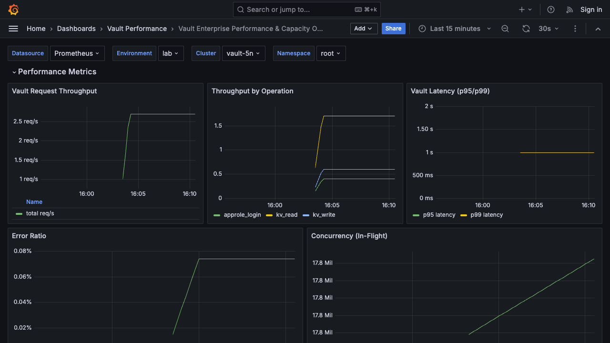

# Local Grafana OSS Preview Guide (Vault Performance Dashboard)

This guide runs a local Grafana OSS + Prometheus stack and loads:
- `dashboards/grafana/vault-performance-observability-dashboard.json`

It uses synthetic Prometheus recording rules so the dashboard renders with sample data for visual review.

The dashboard is organized into three sections:
- **Performance Metrics**
- **Capacity Metrics**
- **Injector Capacity Metrics**

Synthetic rules in `monitoring/local-preview/prometheus/rules/vault-synthetic.yml` populate all four resource dimensions (CPU, memory, disk, network) for both Vault capacity and injector capacity sections.

## 1. Start local preview stack

```bash
cd monitoring/local-preview
docker compose up -d
```

## 2. Verify services

```bash
docker compose ps
curl -sSf http://localhost:3000/api/health
curl -sSf http://localhost:9090/-/ready
```

## 3. Open dashboard

Dashboard URL:

`http://localhost:3000/d/vault-perf-capacity/vault-enterprise-performance-capacity-observability`

Use variable values:
- `env=lab`
- `cluster=vault-5n`
- `namespace=root`

If a panel is blank, check that the matching synthetic metric exists with expected labels (`env`, `cluster`, `namespace`, `job`) and that the selected dashboard variables match those label values.

## 4. Visual preview artifact

Captured screenshot:

`docs/assets/grafana-dashboard-preview.png`



## 5. Stop local preview stack

```bash
cd monitoring/local-preview
docker compose down
```
