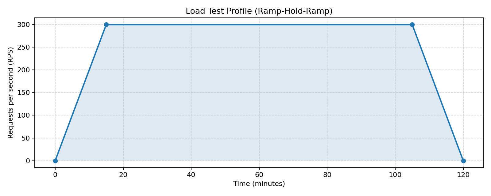
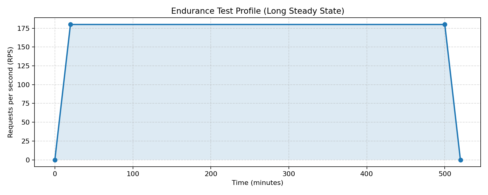
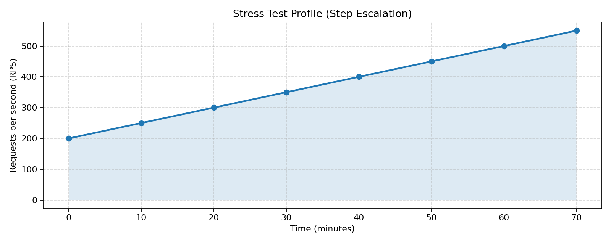
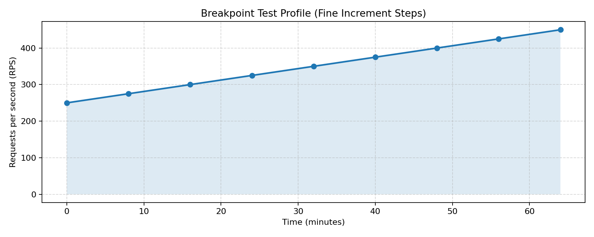

# Vault Enterprise Performance Test Plan (5-Node On-Prem VM Cluster)

## 1. Document control
| Field | Value |
| --- | --- |
| Document title | Vault Enterprise Performance Test Plan - 5-Node On-Prem VM |
| Version | 1.0 |
| Owner | Platform Engineering + Security Engineering |
| Date | 2026-04-24 |
| Reviewers | Vault SME, SRE Lead, Application Platform Lead |
| Approval status | Draft |

## 2. Purpose
Validate that a 5-node on-prem Vault Enterprise cluster (Raft integrated storage reference architecture) can meet expected KV and AppRole workload demand with stable latency, acceptable error rate, and predictable capacity headroom.

## 3. System under test (SUT) overview
| Component | Details |
| --- | --- |
| Vault version/edition | Vault Enterprise (customer target version) |
| Topology | 5-node Raft integrated storage cluster on on-prem VMs |
| Reference architecture | <https://developer.hashicorp.com/vault/tutorials/day-one-raft/raft-reference-architecture> |
| Node sizing assumption | 8 vCPU, 32 GB RAM, NVMe-backed storage, 10GbE |
| Auth method under test | AppRole |
| Secret engine under test | KV v2 (read + write) |
| Network zones | Load injector VLAN -> Vault VLAN via L4 VIP |
| External dependencies | DNS, NTP, virtualization platform |

## 4. Objectives
1. Validate AppRole login and KV read/write SLA at expected production peak.
2. Establish safe operating envelope before saturation.
3. Identify bottlenecks and produce scaling/tuning recommendations.

## 5. Scope
### 5.1 In scope
- AppRole login API (`/v1/auth/*/approle/*`).
- KV v2 read and write APIs (`/v1/<mount>/data/*`).
- Vault and VM capacity utilization under the defined scenarios.
- Load injector saturation monitoring.

### 5.2 Out of scope
- PKI/Transit/Database secret engines.
- HA failover chaos testing.
- Security penetration testing.

## 6. Stakeholders and RACI
| Activity | Platform Team | Security Team | App Team | Vault SME | SRE/Ops |
| --- | --- | --- | --- | --- | --- |
| Scope and criteria definition | A/R | C | C | C | C |
| Script preparation | R | C | C | A/R | C |
| Environment readiness | A/R | C | I | C | R |
| Test execution | R | I | I | A/R | R |
| Monitoring + evidence capture | R | I | I | C | A/R |
| Result analysis | C | C | C | A/R | R |
| Final sign-off | A | A | A | C | C |

## 7. Assumptions and dependencies
- Cluster is configured per Raft reference guidance and stable before tests.
- Telemetry is available in Prometheus/Grafana.
- Dedicated injector VM is reserved for the full test window.
- Test identities, policies, and KV paths are pre-created.

## 8. Risks and mitigations
| Risk | Impact | Mitigation | Owner |
| --- | --- | --- | --- |
| Injector bottleneck | Invalid conclusions about Vault capacity | Keep injector CPU <70%, memory <75%; monitor injector network and dropped iterations | Performance Lead |
| Non-representative request mix | Capacity forecast error | Use agreed KV/AppRole transaction mix from app owners | App Team |
| Shared VM host contention | Noisy results | Reserve dedicated host pool / schedule maintenance freeze | Infrastructure Team |
| Telemetry gaps | Incomplete RCA | Run observability dry-run before test day | SRE |

## 9. Testing approach
### 9.1 Transaction mix
- AppRole login: **20%**
- KV read: **60%**
- KV write: **20%**

### 9.2 Execution phases
1. Baseline (no-load and low-load checks).
2. Load test.
3. Endurance test.
4. Stress test.
5. Breakpoint test.
6. Results analysis + recommendation workshop.

## 10. Scenario catalog
| Scenario | Purpose | Approach | Load profile |
| --- | --- | --- | --- |
| Load | Validate business-expected peak | Ramp + hold at target steady-state | 0 -> 300 RPS in 15 min; hold 90 min; ramp down 15 min |
| Endurance | Validate long-run stability and drift | Constant representative load | 180 RPS sustained for 8 hours |
| Stress | Observe degradation behavior | Step load beyond expected peak | 200 -> 550 RPS in +50 RPS every 10 min |
| Breakpoint | Find practical saturation knee point | Fine-grain incremental steps | 250 RPS start; +25 RPS every 8 min until criteria breach |

### 10.1 Sample load profile graphs
These are illustrative shapes for this plan:

#### Load test profile

#### Endurance test profile

#### Stress test profile

#### Breakpoint test profile

## 11. Success criteria
| Dimension | Criteria |
| --- | --- |
| AppRole latency | p95 <= 120 ms, p99 <= 220 ms at load-test steady-state |
| KV read latency | p95 <= 80 ms, p99 <= 150 ms at load-test steady-state |
| KV write latency | p95 <= 140 ms, p99 <= 260 ms at load-test steady-state |
| Error rate | <= 1.0% total non-2xx responses |
| Throughput | Sustained >= 300 RPS during load-test hold period |
| Capacity headroom | Vault node CPU <= 75%, memory <= 80%, disk used <= 70% |
| Injector health | Injector CPU <= 70%, memory <= 75%, no persistent dropped iterations |

## 12. Monitoring and telemetry model
### 12.1 Performance metrics
- End-to-end response time (p50/p95/p99) by operation.
- Throughput/RPS/TPS by operation.
- Error rate (4xx/5xx/timeout breakdown).
- Concurrency / in-flight requests.

### 12.2 Capacity metrics (Vault platform)
- CPU, memory, disk utilization and disk latency.
- Network RX/TX throughput.
- Raft storage behavior and replication lag (if exposed).

### 12.3 Injector metrics
- Injector CPU/memory/network.
- Client-side timeouts, dropped iterations, and queueing indicators.

### 12.4 Visualization
- Dashboard JSON used: `dashboards/grafana/vault-performance-observability-dashboard.json`
- Local preview screenshot: `docs/assets/grafana-dashboard-preview.png`

## 13. Entry and exit criteria
### Entry criteria
- Cluster healthy and sealed/unsealed workflow verified.
- Monitoring stack reachable and dashboard query health validated.
- Test data and AppRole credentials loaded.

### Exit criteria
- All four scenarios executed or deviation documented.
- Metrics and screenshots captured for each scenario window.
- Recommendations reviewed with stakeholders.

## 14. Results analysis and report generation activities
1. Consolidate K6 output and Grafana telemetry per scenario.
2. Compare observed values against success criteria.
3. Classify bottlenecks: Vault app layer, VM resource, storage/network, injector.
4. Generate recommendation set (tuning, scale-up, architecture changes).
5. Publish final report using `docs/vault-performance-test-results-report-template.md`.

## 15. Sign-off
| Role | Name | Sign-off |
| --- | --- | --- |
| Platform owner | `<name>` | Pending |
| Security owner | `<name>` | Pending |
| App owner | `<name>` | Pending |
| Vault SME | `<name>` | Pending |

